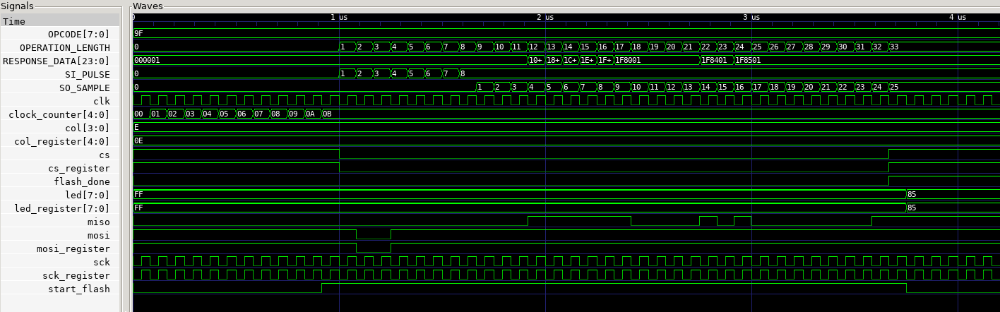

# Flash Read ID Operation

This project directory contains an implimentation of the `Read Manufacturer and Device ID (9Fh)` operation initiated by the FPGA device on the iceFUN, to the [flash device](https://www.digikey.com/htmldatasheets/production/1568138/0/0/1/at25sf081-shd-t.html) on the iceFUN.

# Use

It is possible to install the necessary pre-requisites for compilation and testing from two sources:

- [robot electronics webpage](https://www.robot-electronics.co.uk/icefun.html)

- [apio](https://github.com/FPGAwars/apio)

# Expected behavior

When this directory is compiled and uploaded to the iceFUN, it sets the `CS` line to low, and then sends the command hex : `9F` to the Flash device from the FPGA on the `MOSI` line.

The Flash device specification indicates that the response from the Flash to the FPGA on the `MISO` line should be hex: `1F`, `85`, `01`.

In the flash.v code, the `MISO` data is routed to the LEDs - which would then light up column 0 with the middle byte: `85`, corresponding to the binary `1000 0101`.

The LED lights are in on-state when they are set to `0`, and off-state when set to `1`, so the pattern on the LEDs should read: `off on on on on off on off`.

The `CS` line is then be set back to high to signal the operation end.

# Waveform testbench output

# Actual behavior

When compiled and uploaded, the LEDs on column 0 are in the state : `on on on on on on on on`.